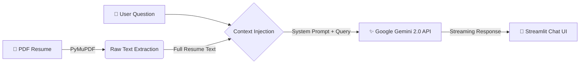

# 👨‍💻 JisangFolio

> **"읽지 말고 대화하는 이력서."**
> 정적인 PDF 문서의 한계를 넘어, 채용 담당자와 실시간으로 소통하며 제 경험과 역량을 증명하는 **AI 에이전트**입니다.

## 🚀 Project Overview

**JisangFolio**는 저의 이력서를 기반으로 면접관의 질문에 답변하는 인터랙티브 AI 챗봇입니다.

본 프로젝트는 **Gemini 2.0 Flash** 모델의 **Long Context Window** 능력을 활용하여, 문서를 통째로 이해하고 답변하는 **Lightweight Architecture**를 채택했습니다.

## 🏗 System Architecture (Lightweight & Fast)

불필요한 임베딩/검색 과정을 제거하고, LLM이 전체 맥락을 보고 정확하게 답변하도록 설계했습니다.

## 🛠 Tech

UI/UX: Streamlit
Language: Python

## 📬 Contact

Email: jjpark324434@gmail.com
Role: Data Engineer
