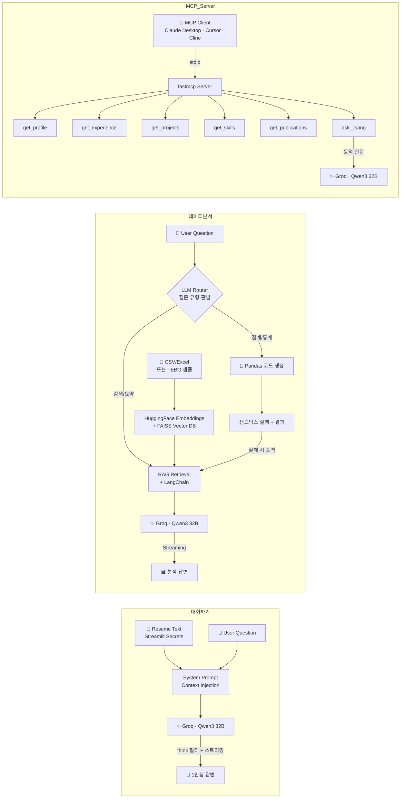

# 👨‍💻 JisangFolio

> **"읽지 말고 대화하는 이력서."**
> 이력서를 PDF로 또 보내는 게 싫어서, 아예 물어볼 수 있게 만든 포트폴리오입니다. 이력서 전문을 물고 있는 챗봇 + 데이터분석 데모 + MCP 서버로 구성돼 있어요.

[](https://www.python.org/)
[](https://streamlit.io/)
[](https://groq.com/)
[](https://plotly.com/)
[](https://github.com/facebookresearch/faiss)
[](https://modelcontextprotocol.io/)

## 🚀 Project Overview

**JisangFolio**는 이력서를 기반으로 면접관의 질문에 답변하는 AI 인터랙티브 포트폴리오입니다. 챗봇·데이터분석·MCP 서버 세 파이프라인이 각각 따로 돕니다.

- **채팅 파이프라인**: 이력서 전문(~3K 토큰)을 시스템 프롬프트에 직접 주입 — RAG 없이도 모든 경험을 정확하게 답변. Qwen3 thinking 모드를 `/no_think` + 스트리밍 필터로 제어.
- **데이터 분석 파이프라인**: LLM 라우터가 질문 유형을 자동 판별해 집계·통계는 pandas 코드를 생성·샌드박스 실행, 검색·요약은 FAISS RAG로 처리.
- **MCP 서버 파이프라인**: 포트폴리오 데이터를 Model Context Protocol 툴로 노출. Claude Desktop · Cursor · Claude Code 등 어떤 MCP 클라이언트에서도 박지상의 경험을 직접 조회 가능.

## 🌟 Highlights

- **포트폴리오 자체가 프로젝트** — 소개 페이지가 아니라, 버튼 누르면 실제로 도는 데모 3개 (목업 아님)
- **회귀 평가 하니스 내장** — 결정적 채점 + LLM-as-judge로 챗봇 답변의 사실성을 오프라인 검증 (`evals/`)
- **코드 지식그래프 임베드** — 코드베이스를 인터랙티브 그래프로 시각화(Graphify · 로컬 AST). `prompts.py`가 앱·평가를 잇는 단일 소스(SSOT) 허브임을 홈에서 바로 확인
- **실제 운영 화면 포함** — KETI 연구의 Prometheus + Grafana 대시보드 스크린샷 임베드
- **실제 SCIE 논문 데이터** — TEBO 균형 분석 745건이 데이터 분석 페이지에 즉시 로드
- **MCP 호환** — Claude Desktop, Cursor, Cline 등에서 6개 툴로 노출되는 표준 프로토콜 서버

## 📁 Project Structure

```
jisangfolio/
├── jisangfolio.py              # 홈 (소개·타임라인·아키텍처 탭)
├── pages/
│   ├── 1_대화하기.py           # AI 챗봇 (한/영)
│   └── 2_데이터분석.py         # JisangData (LLM 라우터 + RAG)
├── jisangfolio_mcp.py          # MCP 서버 (6 tools)
├── prompts.py                  # 시스템 프롬프트 SSOT (앱·평가 공유)
├── evals/                      # 회귀 평가 하니스 (결정적 + LLM judge)
│   ├── run_evals.py            #   실행 → report.md 생성
│   ├── golden_chat.jsonl       #   챗봇 골든셋 (16)
│   └── golden_router.jsonl     #   라우터 골든셋 (20)
├── tebo_sample.xlsx            # TEBO 논문 샘플 데이터 (745건)
├── mlops_grafana.png           # KETI MLOps 대시보드 스크린샷
├── codegraph.html              # 코드 지식그래프 (Graphify · 홈에 임베드)
├── resume.pdf                  # 이력서 PDF
├── requirements.txt
└── README.md
```

## 📄 Pages

| 페이지 | 설명 |
|--------|------|
| **소개** (`jisangfolio.py`) | 프로필 · 경력 타임라인 · 주요 프로젝트 · 기술 스택 · 아키텍처 탭 · 코드 지식그래프 |
| **대화하기** (`pages/1_대화하기.py`) | AI 면접 챗봇 · 한/영 전환 · 멀티턴 · 추천 질문 · 대화 내보내기 |
| **데이터분석** (`pages/2_데이터분석.py`) | TEBO 샘플 데이터 내장 · LLM 라우터 · pandas 코드 생성 · RAG · 자동 폴백 |
| **MCP 서버** (`jisangfolio_mcp.py`) | Claude Desktop·Cursor·Cline 등에서 사용 가능한 6개 툴 |

## ✨ Features

- **AI 면접 챗봇**: 1인칭 페르소나로 면접 질문에 실시간 스트리밍 답변
- **한국어 / English 전환**: 전 페이지(소개·대화하기) 완전 이중 언어 지원
- **Thinking 필터**: Qwen3 `<think>` 블록을 스트리밍 단에서 필터링, 사고 과정 비노출 + `💭` 대기 표시
- **멀티턴 대화**: 이전 대화 맥락을 유지하며 꼬리 질문까지 처리
- **추천 질문**: 사이드바 버튼 클릭으로 바로 전송
- **대화 내보내기**: 대화 기록을 텍스트 파일로 다운로드
- **TEBO 샘플 데이터 내장**: 업로드 없이 SCIE 논문 실제 데이터(745건)로 즉시 체험
- **LLM 라우터**: 집계·통계 질문 → pandas 코드 생성·샌드박스 실행 (코드 UI 표시), 검색·요약 → RAG, 실패 시 자동 폴백
- **MCP 서버**: `fastmcp` 기반 6개 툴 노출, 동적 질문은 Groq + Qwen3 32B로 처리
- **경력 타임라인**: Plotly Gantt 차트로 학력·경력·군복무·논문 시각화
- **MLOps 대시보드 스크린샷**: KETI 연구 Prometheus+Grafana 실제 운영 화면 포함
- **회귀 평가 하니스**: `evals/`에서 챗봇·라우터 출력을 결정적 채점(사실 키워드·금지어·형식) + LLM-as-judge로 정량 검증 — 프롬프트/모델 변경 시 품질 회귀 방지
- **코드 지식그래프**: 코드베이스를 인터랙티브 force-directed 그래프로 시각화(Graphify, 로컬 AST 추출). 손으로 그린 게 아니라 코드에서 파싱한 실제 콜그래프라, `prompts.py`가 앱·평가를 잇는 단일 소스 허브임이 눈으로 보임 — 노드 클릭으로 탐색
- **이력서 PDF 다운로드**

## 🛠 Tech Stack

| 구분 | 기술 |
|------|------|
| UI/UX | Streamlit |
| LLM | Groq · Qwen3 32B |
| RAG & Vector DB | LangChain · FAISS · HuggingFace Embeddings (all-MiniLM-L6-v2) |
| MCP Server | fastmcp |
| Data Processing | Pandas |
| Visualization | Plotly |
| Eval | 회귀 평가 하니스 (결정적 채점 + LLM-as-judge) |
| Language | Python |


```mermaid
graph LR
    subgraph 대화하기
        A[📄 Resume Text\nStreamlit Secrets] --> B[System Prompt\nContext Injection]
        C[🙋 User Question] --> B
        B --> D[✨ Groq · Qwen3 32B]
        D -->|think 필터 + 스트리밍| E[💬 1인칭 답변]
    end

    subgraph 데이터분석
        F[📂 CSV/Excel\n또는 TEBO 샘플] --> G[HuggingFace Embeddings\n+ FAISS Vector DB]
        H[🙋 User Question] --> L{LLM Router\n질문 유형 판별}
        L -->|집계/통계| M[🐼 Pandas 코드 생성]
        M --> N[샌드박스 실행 + 결과]
        L -->|검색/요약| I[RAG Retrieval\n+ LangChain]
        G --> I
        I --> J[✨ Groq · Qwen3 32B]
        J -->|Streaming| K[📊 분석 답변]
        N -->|실패 시 폴백| I
    end

    subgraph MCP_Server
        P[🤖 MCP Client\nClaude Desktop · Cursor · Cline] -->|stdio| Q[fastmcp Server]
        Q --> R1[get_profile]
        Q --> R2[get_experience]
        Q --> R3[get_projects]
        Q --> R4[get_skills]
        Q --> R5[get_publications]
        Q --> R6[ask_jisang]
        R6 -->|동적 질문| D2[✨ Groq · Qwen3 32B]
    end
```

## ⚙️ Setup

1. 의존성 설치
```bash
pip install -r requirements.txt
```

2. `.streamlit/secrets.toml` 설정
```toml
groq_api_key = "YOUR_GROQ_API_KEY"
resume_text  = "YOUR_RESUME_TEXT"
```

3. (선택) 이력서 PDF 다운로드 버튼 활성화
```bash
cp your_resume.pdf resume.pdf
```

4. 실행
```bash
streamlit run jisangfolio.py
```

> **샘플 데이터**: `tebo_sample.xlsx`가 프로젝트 루트에 있으면 데이터분석 페이지에서 업로드 없이 바로 체험 가능합니다.

## 🔌 MCP Server

JisangFolio는 **Model Context Protocol(MCP) 서버**를 내장하고 있습니다.  
MCP는 오픈 프로토콜이라 Claude Desktop뿐 아니라 다양한 클라이언트에서 동일한 서버를 사용할 수 있습니다.

**지원 클라이언트**

- Claude Desktop
- Claude Code (CLI) — `/mcp` 명령어로 추가
- Cursor — Settings → MCP
- Cline (VS Code 확장)
- Continue.dev (VS Code 확장)
- Windsurf
- 기타 MCP 호환 클라이언트

**노출되는 툴**

| 툴 | 설명 |
|---|---|
| `get_profile` | 기본 프로필 · 학력 · 연락처 |
| `get_experience` | KETI · 삼성SDI 경력 (`company` 파라미터 지원) |
| `get_projects` | 주요 프로젝트 · 개인 프로젝트 |
| `get_skills` | 카테고리별 기술 스택 |
| `get_publications` | SCIE 논문 및 기여 내용 |
| `ask_jisang` | 자유 질문 → Groq + Qwen3 32B 1인칭 동적 답변 |

**연결 방법** — Claude Desktop 예시 (`~/Library/Application Support/Claude/claude_desktop_config.json`)

```json
{
  "mcpServers": {
    "jisangfolio": {
      "command": "python",
      "args": ["/path/to/jisangfolio/jisangfolio_mcp.py"],
      "env": {
        "GROQ_API_KEY": "your_groq_api_key"
      }
    }
  }
}
```

Cursor·Cline·Continue·Windsurf도 거의 동일한 `command + args + env` 구조를 사용합니다. 클라이언트 재시작 후 "박지상의 MLOps 경험 알려줘" 또는 "ask_jisang으로 질문해줘" 형태로 사용하면 됩니다.

## 📬 Contact

- Email: jjpark324434@gmail.com
- GitHub: [github.com/jisangfolio](https://github.com/jisangfolio)
- LinkedIn: [linkedin.com/in/jisangpark](https://linkedin.com/in/jisangpark)
- Portfolio: [jisangfolio.streamlit.app](https://jisangfolio.streamlit.app)
