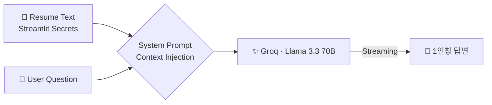

# 👨‍💻 JisangFolio

> **"읽지 말고 대화하는 이력서."**
> 정적인 PDF 문서의 한계를 넘어, 채용 담당자와 실시간으로 소통하며 제 경험과 역량을 증명하는 **AI 인터랙티브 포트폴리오**입니다.

[](https://www.python.org/)
[](https://streamlit.io/)
[](https://groq.com/)
[](https://plotly.com/)

## 🚀 Project Overview

**JisangFolio**는 저의 이력서를 기반으로 면접관의 질문에 답변하는 인터랙티브 AI 포트폴리오입니다.

**Groq (Llama 3.3 70B)**를 활용해 이력서 전문을 시스템 프롬프트에 직접 주입, 별도의 RAG 파이프라인 없이 빠른 스트리밍 답변을 제공하는 Lightweight Architecture를 채택했습니다.

## 📄 Pages

| 페이지 | 설명 |
|--------|------|
| **소개** (`jisangfolio.py`) | 프로필 · 작동 원리 · 경력 타임라인 · 주요 프로젝트 · 기술 스택 |
| **대화하기** (`pages/1_대화하기.py`) | AI 면접 챗봇 · 추천 질문 버튼 |

## ✨ Features

- **AI 면접 챗봇**: 1인칭 페르소나로 면접 질문에 실시간 스트리밍 답변
- **추천 질문**: 사이드바 버튼 클릭으로 바로 질문 전송
- **경력 타임라인**: Plotly Gantt 차트로 학력·경력·군복무·논문 시각화
- **한국어 / English 전환**: 소개 페이지 전체 언어 토글
- **이력서 다운로드**: PDF 다운로드 버튼

## 🛠 Tech Stack

- **UI/UX**: Streamlit
- **LLM**: Groq (Llama 3.3 70B)
- **Visualization**: Plotly
- **Language**: Python


```mermaid
graph LR
    A[📄 Resume Text\nStreamlit Secrets] --> B{System Prompt\nContext Injection}
    C[🙋 User Question] --> B
    B --> D[✨ Groq · Llama 3.3 70B]
    D -->|Streaming| E[💬 1인칭 답변]
```

## ⚙️ Setup

1. 의존성 설치
```bash
pip install -r requirements.txt
```

2. `.streamlit/secrets.toml` 설정
```toml
groq_api_key = "YOUR_GROQ_API_KEY"
resume_text = "YOUR_RESUME_TEXT"
```

3. (선택) 이력서 PDF 다운로드 버튼 활성화
```bash
cp your_resume.pdf resume.pdf
```

4. 실행
```bash
streamlit run jisangfolio.py
```

## 📬 Contact

- Email: jisang.park916@gmail.com
- LinkedIn: [linkedin.com/in/jisangpark](https://linkedin.com/in/jisangpark)
