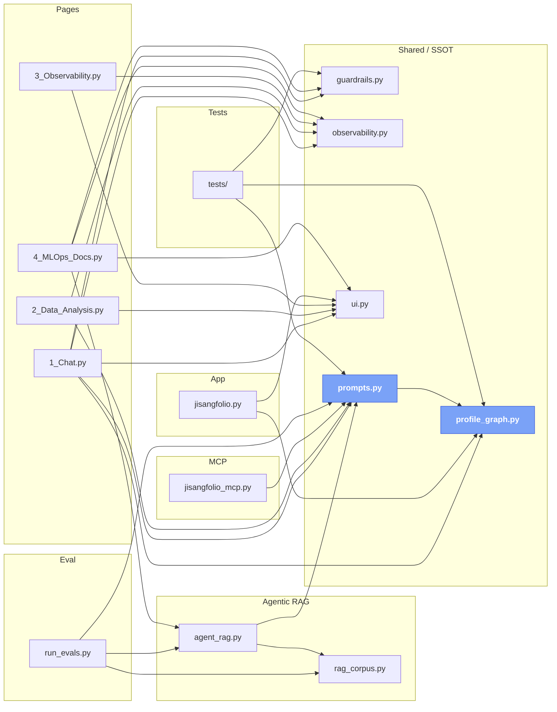

# JisangFolio

> **A résumé you talk to.** Instead of emailing yet another PDF, I built an interactive AI portfolio you can ask anything about my experience — plus a live data-analysis demo and an MCP server. English by default, with a Korean toggle.

🔗 **Live:** [jisangfolio.streamlit.app](https://jisangfolio.streamlit.app)

[](https://www.python.org/)
[](https://streamlit.io/)
[](https://groq.com/)
[](https://modelcontextprotocol.io/)
[](https://github.com/jisangfolio/jisangfolio/actions/workflows/ci.yml)

## Overview

JisangFolio is an interactive AI portfolio for **Jisang Park** — an AI · MLOps engineer. Four independent pipelines run behind one Streamlit surface:

- **Chat** — the résumé is injected directly into the system prompt (no document RAG needed for ~3K tokens), GraphRAG retrieves a focused profile subgraph per question as extra grounding, and the bot answers in the first person, as me. Runs on Groq (Qwen3, reasoning disabled for low latency), with a Korean/English toggle, a guardrails layer + off-topic scope guard, and a post-processing filter that keeps Korean answers Korean.
- **Data Analysis** — upload a CSV/Excel file and an LLM router decides between generating & sandbox-executing pandas code (for aggregates) and hybrid retrieval — FAISS (dense) + BM25 (sparse) fused with RRF — for search, with automatic RAG fallback on code failure.
- **MCP Server** — the portfolio data is exposed over the Model Context Protocol, so Claude Desktop / Cursor / Cline can query it directly.
- **MLOps Docs Assistant (Agentic RAG)** — a self-correcting RAG over a large MLOps pipeline corpus (official Google/AWS/Azure/Vertex docs + an on-prem KETI pipeline reference): retrieve → grade relevance → rewrite & re-retrieve → answer with citations → self-check groundedness. It refuses out-of-corpus questions and is regression-tested on a golden set.

## Architecture

Four pipelines behind one Streamlit surface, wired through two shared **single-source-of-truth** modules — `prompts.py` (prompt / post-processing) and `profile_graph.py` (the profile knowledge graph). Those same modules feed the app pages, the MCP server, the eval harness, *and* the tests, so the graph and the bot never drift apart. The two SSOT hubs are highlighted:


```mermaid
graph LR
  subgraph App
    n_jisangfolio["jisangfolio.py"]
  end
  subgraph Pages
    n_1_Chat["1_Chat.py"]
    n_2_Data_Analysis["2_Data_Analysis.py"]
    n_3_Observability["3_Observability.py"]
    n_4_MLOps_Docs["4_MLOps_Docs.py"]
  end
  subgraph RAG["Agentic RAG"]
    n_agent_rag["agent_rag.py"]
    n_rag_corpus["rag_corpus.py"]
  end
  subgraph MCP
    n_jisangfolio_mcp["jisangfolio_mcp.py"]
  end
  subgraph Eval
    n_run_evals["run_evals.py"]
  end
  subgraph Tests
    tests["tests/"]
  end
  subgraph ssot["Shared / SSOT"]
    n_guardrails["guardrails.py"]
    n_observability["observability.py"]
    n_profile_graph["profile_graph.py"]
    n_prompts["prompts.py"]
    n_ui["ui.py"]
  end
  n_1_Chat --> n_guardrails
  n_1_Chat --> n_observability
  n_1_Chat --> n_profile_graph
  n_1_Chat --> n_prompts
  n_1_Chat --> n_ui
  n_2_Data_Analysis --> n_observability
  n_2_Data_Analysis --> n_prompts
  n_2_Data_Analysis --> n_ui
  n_3_Observability --> n_observability
  n_3_Observability --> n_ui
  n_jisangfolio --> n_profile_graph
  n_jisangfolio --> n_ui
  n_jisangfolio_mcp --> n_prompts
  n_prompts --> n_profile_graph
  n_run_evals --> n_prompts
  n_run_evals --> n_agent_rag
  n_run_evals --> n_rag_corpus
  n_4_MLOps_Docs --> n_agent_rag
  n_4_MLOps_Docs --> n_guardrails
  n_4_MLOps_Docs --> n_observability
  n_4_MLOps_Docs --> n_ui
  n_agent_rag --> n_rag_corpus
  n_agent_rag --> n_prompts
  tests --> n_guardrails
  tests --> n_profile_graph
  tests --> n_prompts
  classDef hub fill:#7AA2F7,stroke:#3b5bdb,color:#fff,font-weight:bold;
  class n_prompts,n_profile_graph hub;
```

> Module-import graph, auto-derived from the codebase (GitHub renders this natively). An interactive, function-level version (vis-network, 88 nodes) is embedded on the [live site](https://jisangfolio.streamlit.app) and in `assets/codegraph.html`.

## Highlights

- **The home is the portfolio** — a photo hero, About, a career timeline, Projects, Skills, Education, the pipeline diagrams, and two knowledge graphs, all on one page.
- **Profile knowledge graph (SSOT)** — education, work, projects, skills, and coursework defined as nodes/edges in `profile_graph.py`, embedded as an interactive graph *and* injected into the chatbot's system prompt — so the graph and the bot share one source of truth.
- **Code knowledge graph** — the codebase visualized as an interactive AST call graph (modules · imports · calls), showing `prompts.py` and `profile_graph.py` as the SSOT hubs shared by the app pages, MCP server, eval harness, and tests.
- **Regression eval harness** — `evals/` scores the chatbot and router with deterministic checks (fact keywords · banned terms) + an LLM-as-judge (a *different* model, to avoid self-scoring bias). It once caught a stale résumé copy leaking into the bot and lifted factual accuracy from 62% to 94%.
- **GraphRAG over the profile graph** — each chat question retrieves a focused subgraph (seed nodes + neighbor traversal) that's injected as extra grounding; the traversed nodes are shown live under every answer.
- **Guardrails layer** — a programmatic input guard (prompt-injection · scope · length) runs *before* anything reaches the model, on top of the persona's scope rule.
- **LLM observability** — every chat / data turn is traced (latency · model · routing · guardrail verdict) on a self-hosted-style dashboard page — same idea as Langfuse / Arize Phoenix, built in-house to match the on-prem, no-external-SaaS approach.
- **Hybrid retrieval** — the data page fuses dense (FAISS) and sparse (BM25) search with Reciprocal Rank Fusion, on top of the LLM router.
- **Agentic RAG (MLOps Docs Assistant)** — a self-correcting loop over official cloud + on-prem MLOps docs: it grades its own retrieval, rewrites the query and re-retrieves when results are weak (which also bridges English queries to Korean docs), cites its sources, refuses out-of-corpus questions, and self-checks groundedness. The agent's step trace is shown live under each answer, and it's regression-tested (retrieval hit + faithfulness) on a golden set.
- **Tested & CI'd** — a `pytest` suite (guardrails · GraphRAG · post-processing · graph integrity) runs on every push via GitHub Actions. The quality bar is enforced, not assumed.
- **Real artifacts** — a Prometheus + Grafana screenshot from my KETI work, and 745 records from my published SCIE paper loaded into the data page.

## Project structure

```
jisangfolio/
├── jisangfolio.py              # Home (hero · about · timeline · projects · skills · education · pipelines · graphs)
├── pages/
│   ├── 1_Chat.py               # AI chatbot (guardrails → GraphRAG → LLM → tracing; EN/KO)
│   ├── 2_Data_Analysis.py      # JisangData (LLM router + pandas codegen + hybrid RAG)
│   ├── 3_Observability.py      # LLM observability dashboard (traces · latency · routing)
│   └── 4_MLOps_Docs.py         # MLOps Docs Assistant (Agentic RAG over the docs corpus)
├── agent_rag.py                # Agentic RAG loop (retrieve → grade → rewrite → generate → self-check)
├── rag_corpus.py               # Docs corpus loader + hybrid retriever (FAISS + BM25)
├── rag_docs/                   # MLOps pipeline corpus (Google/AWS/Azure/Vertex + on-prem KETI)
├── jisangfolio_mcp.py          # MCP server (6 tools)
├── prompts.py                  # Prompt/post-processing SSOT (shared by app + evals + tests)
├── profile_graph.py            # Profile knowledge graph SSOT (home graph · chatbot · GraphRAG)
├── guardrails.py               # Input guardrails layer (injection · scope · length)
├── observability.py            # Trace store + metrics (self-hosted-style LLM observability)
├── ui.py                       # Shared styling (Pretendard font · rounding)
├── evals/                      # Regression eval harness — chat · router · agentic RAG (deterministic + LLM judge)
├── tests/                      # pytest unit tests (guardrails · GraphRAG · post-processing · graph)
├── .github/workflows/ci.yml    # CI — runs the test suite on every push
├── assets/                     # Static assets (grouped to keep the root clean)
│   ├── profile.jpg             #   Hero photo
│   ├── resume.pdf              #   Downloadable résumé
│   ├── codegraph.html          #   Code knowledge graph (interactive AST call graph)
│   ├── mlops_grafana.png       #   KETI MLOps dashboard screenshot
│   └── tebo_sample.xlsx        #   TEBO paper sample data (745 records)
├── .streamlit/config.toml      # Theme (secrets.toml is git-ignored)
└── requirements.txt
```

## Tech stack

| Area | Tools |
|------|-------|
| UI | Streamlit · custom CSS (Pretendard) |
| LLM | Groq (Qwen3) · reasoning disabled for latency |
| RAG / retrieval | LangChain · FAISS · BM25 (hybrid, RRF) · GraphRAG · Agentic RAG (grade → rewrite → self-check) · HuggingFace Embeddings (all-MiniLM-L6-v2) |
| Testing / CI | pytest · GitHub Actions |
| Eval judge | Llama-3.3-70B (separate model) |
| MCP | fastmcp |
| Data | Pandas · Plotly · vis-network |
| Language | Python |

## Setup

```bash
pip install -r requirements.txt
```

Create `.streamlit/secrets.toml` (git-ignored):

```toml
groq_api_key = "YOUR_GROQ_API_KEY"
resume_text  = "YOUR_RESUME_TEXT"
```

Run:

```bash
streamlit run jisangfolio.py
```

## MCP server

The portfolio ships a **Model Context Protocol** server. Add it to Claude Desktop (`claude_desktop_config.json`):

```json
{
  "mcpServers": {
    "jisangfolio": {
      "command": "python",
      "args": ["/path/to/jisangfolio/jisangfolio_mcp.py"],
      "env": { "GROQ_API_KEY": "your_groq_api_key" }
    }
  }
}
```

Exposed tools: `get_profile`, `get_experience`, `get_projects`, `get_skills`, `get_publications`, and `ask_jisang` (free-form first-person Q&A).

## Contact

- Email: jjpark324434@gmail.com
- GitHub: [github.com/jisangfolio](https://github.com/jisangfolio)
- LinkedIn: [linkedin.com/in/jisangpark](https://linkedin.com/in/jisangpark)
- Portfolio: [jisangfolio.streamlit.app](https://jisangfolio.streamlit.app)
