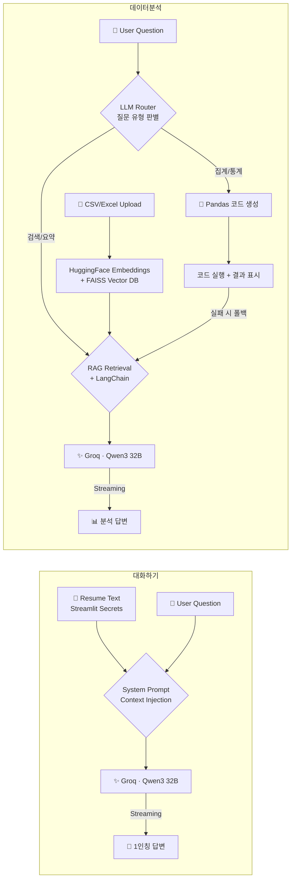

# 👨‍💻 JisangFolio

> **"읽지 말고 대화하는 이력서."**
> 정적인 PDF 문서의 한계를 넘어, 채용 담당자와 실시간으로 소통하며 제 경험과 역량을 증명하는 **AI 인터랙티브 포트폴리오**입니다.

[](https://www.python.org/)
[](https://streamlit.io/)
[](https://groq.com/)
[](https://plotly.com/)

## 🚀 Project Overview

**JisangFolio**는 저의 이력서를 기반으로 면접관의 질문에 답변하는 인터랙티브 AI 포트폴리오입니다.

**Groq (Qwen3 32B)**를 활용해 이력서 전문을 시스템 프롬프트에 직접 주입, 별도의 RAG 파이프라인 없이 빠른 스트리밍 답변을 제공하는 Lightweight Architecture를 채택했습니다.

## 📄 Pages

| 페이지 | 설명 |
|--------|------|
| **소개** (`jisangfolio.py`) | 프로필 · 작동 원리 · 경력 타임라인 · 주요 프로젝트 · 기술 스택 |
| **대화하기** (`pages/1_대화하기.py`) | AI 면접 챗봇 · 추천 질문 · 멀티턴 대화 · 대화 내보내기 |
| **데이터분석** (`pages/2_데이터분석.py`) | CSV/Excel 업로드 → LLM 라우터가 질문 유형 자동 판별 → 집계/통계는 pandas 코드 생성·실행, 검색/요약은 RAG |

## ✨ Features

- **AI 면접 챗봇**: 1인칭 페르소나로 면접 질문에 실시간 스트리밍 답변
- **멀티턴 대화**: 이전 대화 맥락을 유지하며 꼬리 질문까지 자연스럽게 처리
- **추천 질문**: 사이드바 버튼 클릭으로 바로 질문 전송
- **대화 내보내기**: 대화 기록을 텍스트 파일로 다운로드
- **CSV/Excel 데이터 분석**: LLM이 질문 유형 자동 판별 → pandas 코드 생성·실행 (코드 UI 표시) 또는 RAG 검색, 실패 시 자동 폴백
- **경력 타임라인**: Plotly Gantt 차트로 학력·경력·군복무·논문 시각화
- **한국어 / English 전환**: 소개 페이지 전체 언어 토글
- **이력서 다운로드**: PDF 다운로드 버튼

## 🛠 Tech Stack

- **UI/UX**: Streamlit
- **LLM**: Groq (Qwen3 32B)
- **RAG & Vector DB**: LangChain · FAISS · HuggingFace Embeddings
- **Data Processing**: Pandas
- **Visualization**: Plotly
- **Language**: Python


```mermaid
graph LR
    subgraph 대화하기
        A[📄 Resume Text\nStreamlit Secrets] --> B{System Prompt\nContext Injection}
        C[🙋 User Question] --> B
        B --> D[✨ Groq · Qwen3 32B]
        D -->|Streaming| E[💬 1인칭 답변]
    end

    subgraph 데이터분석
        F[📂 CSV/Excel Upload] --> G[HuggingFace Embeddings\n+ FAISS Vector DB]
        H[🙋 User Question] --> L{LLM Router\n질문 유형 판별}
        L -->|집계/통계| M[🐼 Pandas 코드 생성]
        M --> N[코드 실행 + 결과 표시]
        L -->|검색/요약| I{RAG Retrieval\n+ LangChain}
        G --> I
        I --> J[✨ Groq · Qwen3 32B]
        J -->|Streaming| K[📊 분석 답변]
        N -->|실패 시 폴백| I
    end
```

## ⚙️ Setup

1. 의존성 설치
```bash
pip install -r requirements.txt
```

2. `.streamlit/secrets.toml` 설정
```toml
groq_api_key = "YOUR_GROQ_API_KEY"
resume_text = "YOUR_RESUME_TEXT"
```

3. (선택) 이력서 PDF 다운로드 버튼 활성화
```bash
cp your_resume.pdf resume.pdf
```

4. 실행
```bash
streamlit run jisangfolio.py
```

## 📬 Contact

- Email: jjpark324434@gmail.com
- LinkedIn: [linkedin.com/in/jisangpark](https://linkedin.com/in/jisangpark)
