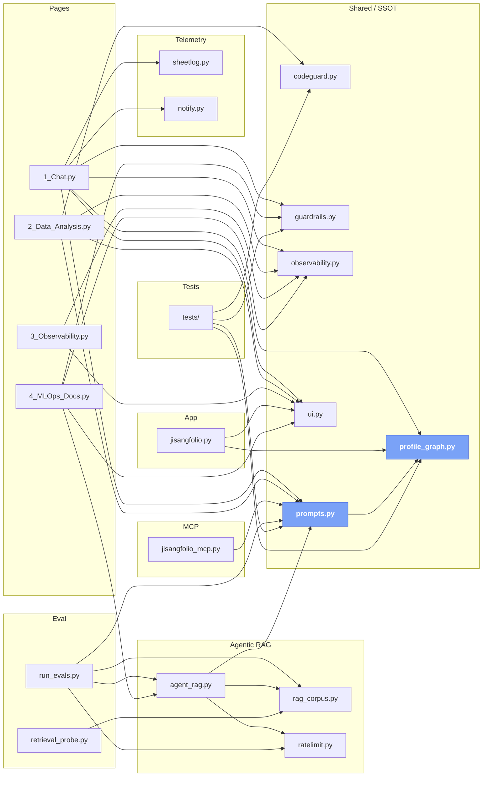

# JisangFolio

> **A résumé you talk to.** Instead of emailing yet another PDF, I built an interactive AI portfolio you can ask anything about my experience — plus a live data-analysis demo and an MCP server. English by default, with a Korean toggle.

🔗 **Live:** [jisangfolio.streamlit.app](https://jisangfolio.streamlit.app)

[](https://www.python.org/)
[](https://streamlit.io/)
[](https://groq.com/)
[](https://modelcontextprotocol.io/)
[](https://github.com/jisangfolio/jisangfolio/actions/workflows/ci.yml)

## Overview

JisangFolio is an interactive AI portfolio for **Jisang Park** — an AI · MLOps engineer. Four independent pipelines run behind one Streamlit surface:

- **Chat** — the résumé is injected directly into the system prompt (no document RAG needed for ~3K tokens), a graph-retrieval step pulls a focused profile subgraph per question as extra grounding (lexical seed + 1-hop traversal — see Highlights for why that is *not* Microsoft's GraphRAG), and the bot answers in the first person, as me. Runs on Groq (Qwen3, reasoning disabled for low latency), with a Korean/English toggle, a guardrails layer + off-topic scope guard, and a post-processing filter that keeps Korean answers Korean.
- **Data Analysis** — upload a CSV/Excel file and an LLM router decides between generating & executing pandas code (for aggregates) and hybrid retrieval — FAISS (dense) + BM25 (sparse) fused with RRF — for search, with automatic RAG fallback on code failure. The generated code runs against a **reduced-capability namespace**: the `pandas` module is never exposed (a module object is a way out of any allowlist — `pd.io.common.os` reaches the OS), only a facade of the ~15 top-level helpers the prompt needs; an AST pass rejects imports, dunder access and — after `to_string(buf=…)` and `df.style.to_html(path)` slipped past an enumerated denylist — **every `to_*` attribute except a read-only allowlist**; builtins are allowlisted. It lives in `codeguard.py` rather than inline in the page, so `tests/test_codeguard.py` can hold the escapes that once worked. Still **not a sandbox** — no timeout, no memory cap, no process isolation — so it is not safe against a determined attacker, only against the escape paths a code-generating LLM actually reaches for.
- **MCP Server** — the portfolio data is exposed over the Model Context Protocol, so Claude Desktop / Cursor / Cline can query it directly.
- **MLOps Docs Assistant (Agentic RAG)** — a self-correcting RAG over an MLOps pipeline corpus (official Google/AWS/Azure/Vertex docs + an on-prem KETI pipeline reference): retrieve → grade relevance → rewrite & re-retrieve (max 1 retry) → answer with citations → self-check groundedness. Out-of-corpus refusal is prompt-induced and measured on the golden set, not enforced in code; the groundedness check is a label on the answer, not a gate that blocks it.

## Architecture

Four pipelines behind one Streamlit surface, wired through two shared **single-source-of-truth** modules — `prompts.py` (prompt / post-processing) and `profile_graph.py` (the profile knowledge graph). Those same modules feed the app pages, the eval harness *and* the tests, so the graph and the bot share one source. One honest exception: the **MCP server keeps a hand-maintained copy** of the résumé prose (its sections are more detailed than the graph nodes, so deriving them would lose information) and shares only the post-processing helpers. That copy did drift once — `tests/test_mcp_drift.py` now fails CI when the two disagree on the facts they share. The two SSOT hubs are highlighted:


```mermaid
graph LR
  subgraph App
    n_jisangfolio["jisangfolio.py"]
  end
  subgraph Pages
    n_1_Chat["1_Chat.py"]
    n_2_Data_Analysis["2_Data_Analysis.py"]
    n_3_Observability["3_Observability.py"]
    n_4_MLOps_Docs["4_MLOps_Docs.py"]
  end
  subgraph RAG["Agentic RAG"]
    n_agent_rag["agent_rag.py"]
    n_rag_corpus["rag_corpus.py"]
    n_ratelimit["ratelimit.py"]
  end
  subgraph MCP
    n_jisangfolio_mcp["jisangfolio_mcp.py"]
  end
  subgraph Eval
    n_run_evals["run_evals.py"]
    n_retrieval_probe["retrieval_probe.py"]
  end
  subgraph Telemetry
    n_sheetlog["sheetlog.py"]
    n_notify["notify.py"]
  end
  subgraph Tests
    tests["tests/"]
  end
  subgraph ssot["Shared / SSOT"]
    n_codeguard["codeguard.py"]
    n_guardrails["guardrails.py"]
    n_observability["observability.py"]
    n_profile_graph["profile_graph.py"]
    n_prompts["prompts.py"]
    n_ui["ui.py"]
  end
  n_1_Chat --> n_guardrails
  n_1_Chat --> n_observability
  n_1_Chat --> n_profile_graph
  n_1_Chat --> n_prompts
  n_1_Chat --> n_ui
  n_1_Chat --> n_sheetlog
  n_1_Chat --> n_notify
  n_2_Data_Analysis --> n_codeguard
  n_2_Data_Analysis --> n_observability
  n_2_Data_Analysis --> n_prompts
  n_2_Data_Analysis --> n_ui
  n_3_Observability --> n_observability
  n_3_Observability --> n_ui
  n_jisangfolio --> n_profile_graph
  n_jisangfolio --> n_ui
  n_jisangfolio_mcp --> n_prompts
  n_prompts --> n_profile_graph
  n_run_evals --> n_prompts
  n_run_evals --> n_agent_rag
  n_run_evals --> n_rag_corpus
  n_4_MLOps_Docs --> n_agent_rag
  n_4_MLOps_Docs --> n_guardrails
  n_4_MLOps_Docs --> n_observability
  n_4_MLOps_Docs --> n_ui
  n_agent_rag --> n_rag_corpus
  n_agent_rag --> n_prompts
  n_agent_rag --> n_ratelimit
  n_run_evals --> n_ratelimit
  n_retrieval_probe --> n_rag_corpus
  tests --> n_codeguard
  tests --> n_guardrails
  tests --> n_profile_graph
  tests --> n_prompts
  classDef hub fill:#7AA2F7,stroke:#3b5bdb,color:#fff,font-weight:bold;
  class n_prompts,n_profile_graph hub;
```

> Module-import graph, auto-derived from the codebase (GitHub renders this natively). An interactive, function-level version (vis-network, 226 nodes) is embedded on the [live site](https://jisangfolio.streamlit.app) and in `assets/codegraph.html` (regenerated by `gen_codegraph.py`).

## Highlights

- **The home is the portfolio** — a photo hero, About, a career timeline, Projects, Skills, Education, the pipeline diagrams, and two knowledge graphs, all on one page.
- **Profile knowledge graph (SSOT)** — education, work, projects, skills, and coursework defined as nodes/edges in `profile_graph.py`, embedded as an interactive graph *and* injected into the chatbot's system prompt — so the graph and the bot share one source of truth.
- **Code knowledge graph** — the codebase visualized as an interactive AST call graph (modules · imports · calls), showing `prompts.py` and `profile_graph.py` as the SSOT hubs shared by the app pages, MCP server, eval harness, and tests.
- **Regression eval harness** — `evals/` scores the chatbot, the router, and the Agentic RAG path with deterministic checks (fact keywords · banned terms · retrieval hits) + an LLM-as-judge (a *different* model, to avoid self-scoring bias). It once caught a stale résumé copy leaking into the bot, taking the chatbot golden set from **10/16 to 15/16**. Read that as a before/after on one fixed set, not a benchmark: n=16 is a wide interval (McNemar p≈0.06). The golden set is **20 cases** today — 9 chat · 8 router · 3 RAG — so the 16 above is neither its current size nor a running score.

> ⚠️ **This number predates a bug in the harness itself and has not been re-measured.** The golden files tag cases `"lang": "ko"` while the app uses `"한국어"`; they met at a `lang == "한국어"` comparison, so 15 of 19 chat cases ran against the *English* system prompt and were then graded on Korean keywords. That is fixed (`normalize_lang`), but 10/16 → 15/16 was measured before the fix, so it does not describe the harness as it stands.

> The deployed app and the harness share one Groq key and one 200k/day budget, and the old 48-case set cost ~169k per sweep — running it handed the day's visitors a 429. Rather than hide that behind a tier the rest of the set would never run in, **the golden set itself was cut to 20 cases (~71k, 35%)**, keeping what breaks a factual claim or can only be answered by calling the model — the résumé guardrails, and off-topic/injection in both languages — and archiving the duplicates under `evals/archive/`. A pre-flight check now also tracks the day's spend and refuses to start a run that will not finish. The corrected figure will be filled in from measured runs, not estimated, and `evals/runs/` holds what has actually been scored so far.
- **Graph retrieval over the profile graph** — each chat question retrieves a focused subgraph (seed nodes by lexical overlap + 1-hop neighbour traversal) that's injected as extra grounding; the traversed nodes are shown live under every answer. I call it "GraphRAG" in the UI for short, but to be precise it is **not** Microsoft's GraphRAG (Edge et al., 2024) — there is no LLM entity extraction and no Leiden community summarisation here. It is closer to classic KGQA subgraph retrieval, over a hand-authored graph, and since the full résumé is already in the prompt its job is emphasis rather than new information.
- **Guardrails layer** — a programmatic input guard (prompt-injection · scope · length) runs *before* anything reaches the model, on top of the persona's scope rule. Patterns cover **Korean and English symmetrically** (an English-only regex let Korean injections through to the persona prompt alone). Scoped honestly: this is a **lightweight regex filter, not an intent classifier** — it catches the blunt phrasings ("ignore all previous instructions", "너는 이제부터 …") and misses paraphrases, and it over-blocks some genuine questions that merely contain "prompt" or "이제". The persona prompt is the second line of defence, and an LLM-based guard (LlamaGuard-style) is the real fix for intent. It guards the app path only — the eval harness calls the model directly.
- **LLM observability** — every chat / data turn is traced (latency · model · routing · guardrail verdict) on a self-hosted-style dashboard page — an in-house, deliberately minimal take on the problem Langfuse / Arize Phoenix solve (in-memory 500-trace ring buffer, no persistence, no token/cost accounting), matching the on-prem, no-external-SaaS approach.
- **Hybrid retrieval** — the data page fuses dense (FAISS) and sparse (BM25) search with Reciprocal Rank Fusion, on top of the LLM router.
- **Agentic RAG (MLOps Docs Assistant)** — a self-correcting loop over official cloud + on-prem MLOps docs: it grades its own retrieval, rewrites the query and re-retrieves once when results are weak (the rewrite prompt asks for cross-language keyword enrichment), cites its sources, and self-checks groundedness as a label. Bounded by design: 3 judgement points, 1 control branch, max 1 retry — a self-correcting pipeline, not an autonomous agent (no tool selection, no state machine). The step trace is shown live under each answer, and it's regression-tested (retrieval hit + grounded label + refusal cases) on a golden set.
- **Retrieval self-diagnosis (measured, not claimed)** — `retrieval_probe.py` measures the retrieval layer's own defects instead of asserting quality. Two it surfaced: the embedder (`all-MiniLM-L6-v2`, 256 word-piece limit) silently truncates long chunks — worst for Korean, which tokenizes into far more pieces — and one document dominated the corpus. Current measurement: **35.9% of chunks truncated overall (Korean 65.6%, English 0%)**, average share of a chunk reaching the encoder **88.2%**. Shrinking chunks 1200 → 500 chars raised that reach figure, but it's worth naming what that number is: a *knob* measurement (how much text survives the encoder), not a retrieval-quality outcome — and chunk overlap moved 150 → 80 in the same change, so the two aren't cleanly separable. The corpus was also rebalanced: the on-prem doc fell from ~89% to **56.4% of chunks** when it was rewritten at architecture level. That rebalance produced the most useful finding here — the cross-lingual probe, which scored 4/5 under the skewed corpus, scores **2/5** under the balanced one. At ~89% dominance a random top-5 almost always contained the target document, so the earlier result was mostly corpus dominance, not cross-lingual retrieval working. 2/5 is the honest read, and a multilingual encoder (or a small-to-big retriever) is the real fix, not more tuning. Caveat kept in the script itself: n=5 probe queries is a trend, not a benchmark.
- **Tested & CI'd** — a `pytest` suite (guardrails · GraphRAG · post-processing · graph integrity) runs on every push via GitHub Actions. Scope is deliberate and limited: CI covers the LLM-free layers only (stdlib-only, so it stays fast and key-free); the eval harness needs an API key and ~90 calls, so it runs manually as a pre-release checkpoint, not as an automated merge gate.
- **Real artifacts** — a Prometheus + Grafana screenshot from my KETI work, and 745 records from my published SCIE paper loaded into the data page.

## Project structure

```
jisangfolio/
├── jisangfolio.py              # Home (hero · about · timeline · projects · skills · education · pipelines · graphs)
├── pages/
│   ├── 1_Chat.py               # AI chatbot (guardrails → GraphRAG → LLM → tracing; EN/KO)
│   ├── 2_Data_Analysis.py      # JisangData (LLM router + pandas codegen + hybrid RAG)
│   ├── 3_Observability.py      # LLM observability dashboard (traces · latency · routing)
│   └── 4_MLOps_Docs.py         # MLOps Docs Assistant (Agentic RAG over the docs corpus)
├── agent_rag.py                # Agentic RAG loop (retrieve → grade → rewrite → generate → self-check)
├── rag_corpus.py               # Docs corpus loader + hybrid retriever (FAISS + BM25)
├── rag_docs/                   # MLOps pipeline corpus (Google/AWS/Azure/Vertex + on-prem KETI)
├── jisangfolio_mcp.py          # MCP server (6 tools)
├── prompts.py                  # Prompt/post-processing SSOT (shared by app + evals + tests)
├── profile_graph.py            # Profile knowledge graph SSOT (home graph · chatbot · GraphRAG)
├── codeguard.py                # Reduced-capability namespace for LLM-generated pandas code
├── guardrails.py               # Input guardrails layer (injection KO/EN · scope · length)
├── observability.py            # Trace store + metrics (self-hosted-style LLM observability)
├── ui.py                       # Shared styling (Pretendard font · rounding)
├── sheetlog.py                 # Chat-turn logging to a private Google Sheet (fail-silent)
├── notify.py                   # Email alert on a new visitor session (fail-silent)
├── retrieval_probe.py          # Retrieval self-diagnosis (embedding truncation · corpus skew · cross-lingual)
├── gen_codegraph.py            # Regenerates assets/codegraph.html from the AST
├── evals/                      # Regression eval harness — chat · router · agentic RAG (deterministic + LLM judge)
├── tests/                      # pytest unit tests (guardrails · GraphRAG · post-processing · graph)
├── .github/workflows/ci.yml    # CI — runs the test suite on every push
├── assets/                     # Static assets (grouped to keep the root clean)
│   ├── profile.jpg             #   Hero photo
│   ├── resume.pdf              #   Downloadable résumé — PUBLIC variant: e-mail only, no phone number
│   ├── codegraph.html          #   Code knowledge graph (interactive AST call graph)
│   ├── mlops_grafana.png       #   KETI MLOps dashboard screenshot (GPU UUID cropped)
│   └── tebo_sample.xlsx        #   TEBO paper sample data (745 records)
├── .streamlit/config.toml      # Theme (secrets.toml is git-ignored)
└── requirements.txt
```

## Tech stack

| Area | Tools |
|------|-------|
| UI | Streamlit · custom CSS (Pretendard) |
| LLM | Groq (Qwen3) · reasoning disabled for latency |
| RAG / retrieval | LangChain · FAISS · BM25 (hybrid, RRF) · graph retrieval over a hand-authored profile KG (*not* Microsoft GraphRAG) · Agentic RAG (grade → rewrite → self-check) · HuggingFace Embeddings (all-MiniLM-L6-v2) |
| Testing / CI | pytest · GitHub Actions |
| Eval judge | Llama-3.3-70B (separate model) |
| MCP | fastmcp |
| Data | Pandas · Plotly · vis-network |
| Language | Python |

## Setup

```bash
pip install -r requirements.txt
```

Create `.streamlit/secrets.toml` (git-ignored):

```toml
groq_api_key = "YOUR_GROQ_API_KEY"
resume_text  = "YOUR_RESUME_TEXT"
```

Run:

```bash
streamlit run jisangfolio.py
```

## MCP server

The portfolio ships a **Model Context Protocol** server. Add it to Claude Desktop (`claude_desktop_config.json`):

```json
{
  "mcpServers": {
    "jisangfolio": {
      "command": "python",
      "args": ["/path/to/jisangfolio/jisangfolio_mcp.py"],
      "env": { "GROQ_API_KEY": "your_groq_api_key" }
    }
  }
}
```

Exposed tools: `get_profile`, `get_experience`, `get_projects`, `get_skills`, `get_publications`, and `ask_jisang` (free-form first-person Q&A).

## Contact

- Email: jjpark324434@gmail.com
- GitHub: [github.com/jisangfolio](https://github.com/jisangfolio)
- LinkedIn: [linkedin.com/in/jisangpark](https://linkedin.com/in/jisangpark)
- Portfolio: [jisangfolio.streamlit.app](https://jisangfolio.streamlit.app)
